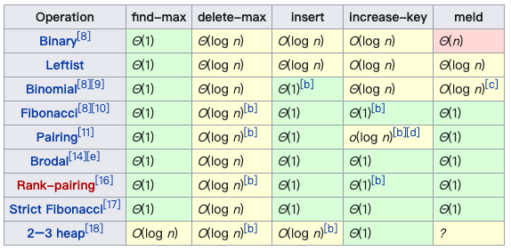

## 数据结构

### 哈希表，集合
哈希表关键知识
* 哈希函数：key 的索引化，变成数组索引，访问 O(1)
* 哈希碰撞：链式法

一般用 Hash 表来实现集合，只有 Key 没有 Value。

这种数据结构在实际的工程中会大量使用，在算法中也会有很多使用的场景。

### 二叉树

> 树：无环，有深度，最常用的是二叉树

#### 普通二叉树

遍历方法

> 访问次序与遍历次序，访问次序是访问到节点，遍历是指访问到节点内容。

* 前序 - 根在前面 处理次序：根->左->右
* 中序 - 根在中间 处理次序：左->根->右
* 后序 - 根在后面 处理次序：左->右->根

核心代码
```java
void visit(Consumer<Node> consumer, Node root) {
  if (root == null) {
     return;
  }
  visit(consumer, root.left);
  consumer.accept(root); // 这个操作不影响节点访问次序
  visit(consumer, root.right);
}
```

`consumer.accept(root)` 位置决定了是中序，前序还是后序。

*划重点* 无论前序后序，其节点访问次序是一样的，但是遍历次序不同。也就是说当访问到节点 A 时，如果 A 不为空。对根的不同遍历次序，决定了前序，中序还是后序。


#### 二叉搜索树

##### 定义

1. 左子树上**所有的节点值**均小于他的根节点的值
2. 右子树上**所有的节点值**均大于他的根节点的值
3. 以此类推：左右子树也分布为二叉搜索树「**重复性**」

*划重点* 只有**中序遍历**可以获得有序序列。「想想为什么」

##### 效率

* AVG 查询、插入、删除 都是 O(log n)
* Worst O(N)， 退化为单链表
* Space Worst O(nlog(n))

##### 关键操作

* 插入
* 删除
* 查找

通过[实现代码](https://www.cnblogs.com/jwongo/p/datastructure-binarysearchtree.html)学习下插入，查找，特别是删除。


#### 堆

##### 定义

> 如果不是 O(1)，都不是迅速

* 可以迅速找到一堆数中最小或最多值得数据结构
* 根节点是最大值的叫大顶或大根堆，反之为小顶堆

##### 关键操作

大顶堆

* find-max 查找最大元素
* delete-max 删除最大元素
* insert 插入新元素

##### 常见实现

* 二叉堆 - 容易实现, 教学用。工业很少用，性能一般。
* 斐波那契堆 
* 严格斐波那契堆 - 性能优异，工业级。

常见堆实现的性能




#### 二叉堆

> 堆的二叉树实现

##### 定义

> 主要完全二叉树和二叉搜索树没关系，别混淆。

1. 完全树，除了最下面一层节点不是满的，其余层节点都是满的（完全二叉树)
2. 树中任意节点的值总是 >= 其子节点的值


##### 索引规则
由于完全树的特性，可以使用数组来表示完全二叉树，其节点索引有以下特性
对于 node(i)

* node.left = 2*i + 1
* node.right = 2*i + 2
* node.parent = floor((i-1)/2)

##### 关键函数
用于调整堆，满足完全二叉树的条件
* HeapifyUp
* HeapifyDown


