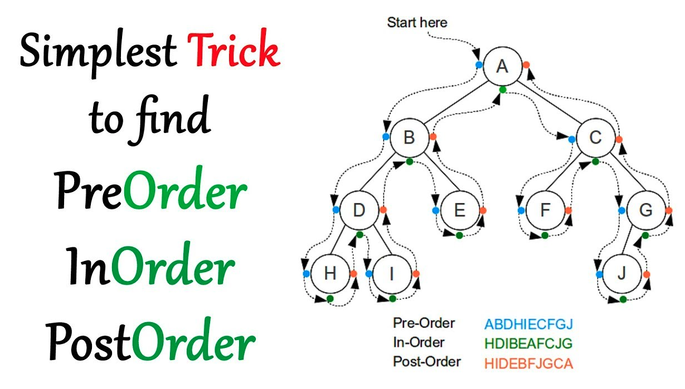

## 数据结构

### 哈希表，集合
哈希表关键知识
* 哈希函数：key 的索引化，变成数组索引，访问 O(1)
* 哈希碰撞：链式法

一般用 Hash 表来实现集合，只有 Key 没有 Value。

这种数据结构在实际的工程中会大量使用，在算法中也会有很多使用的场景。

### 二叉树

> 树：无环，有深度，最常用的是二叉树

#### 普通二叉树

遍历方法

> 访问次序与遍历次序，访问次序是访问到节点，遍历是指访问到节点内容。

* 前序 - 根在前面 处理次序：根->左->右
* 中序 - 根在中间 处理次序：左->根->右
* 后序 - 根在后面 处理次序：左->右->根

*划重点* 无论前序后序，其节点访问次序是一样的，但是处理次序不同。也就是说当访问到节点 A 时，如果 A 不为空。对根的不同处理次序，决定了前序，中序还是后序。

