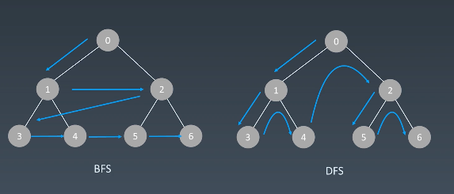

# 学习笔记

## 深度优先搜索、广度优先搜索

### 遍历次序




可视化网站：https://visualgo.net/en/dfsbfs


### 深度优先搜索

#### 遍历特点


#### 代码模板 - 二叉树
```python
visited = set() 

def dfs(node):
    if node in visited: # terminator
    	# already visited 
    	return 

	visited.add(node) 

	# process current node here. 
  dfs(node.left)
  dfs(node.right)
```

#### 代码模板 - 多叉树
```python
visited = set() 

def dfs(node):
    if node in visited: # terminator
    	# already visited 
    	return 

	visited.add(node) 

	# process current node here. 
  # 多叉树情况
	...
	for next_node in node.children(): 
		if next_node not in visited: 
			dfs(next_node)
```


### 广度优先搜索

#### 遍历特点


#### 代码模板

```python
# Python
def BFS(graph, start, end):
    visited = set()
	queue = [] 
	queue.append([start]) 
	while queue: 
		node = queue.pop() 
		visited.add(node)
		process(node) 
		nodes = generate_related_nodes(node) 
		queue.push(nodes)
	# other processing work 
	...
```


### 启发式搜索

优先级搜索，推荐算法


### 题型

#### 实战题目

* [二叉树的层序遍历](https://leetcode-cn.com/problems/binary-tree-level-order-traversal/#/description)（字节跳动、亚马逊、微软在半年内面试中考过）
* [最小基因变化](https://leetcode-cn.com/problems/minimum-genetic-mutation/#/description)
* [括号生成](https://leetcode-cn.com/problems/generate-parentheses/#/description)（字节跳动、亚马逊、Facebook 在半年内面试中考过）
* [在每个树行中找最大值]()（微软、亚马逊、Facebook 在半年内面试中考过）

#### 课后作业

* [单词接龙](https://leetcode-cn.com/problems/word-ladder/description/)（亚马逊在半年内面试常考）
* [单词接龙II](https://leetcode-cn.com/problems/word-ladder-ii/description/) （微软、亚马逊、Facebook 在半年内面试中考过）
* [岛屿数量](https://leetcode-cn.com/problems/number-of-islands/)（近半年内，亚马逊在面试中考查此题达到 350 次）
* [扫雷游戏](https://leetcode-cn.com/problems/minesweeper/description/)（亚马逊、Facebook 在半年内面试中考过）

## 贪心算法

### 定义

一种在每一步选择中都采取在当前状态下最好或最优(即最有利)的选择，从而希望导致结果是全局最好或最优的算法。

现实大部分问题不会直接使用贪心，在辅助流程中使用较多。

困难点：局部最优解未必是全局最优解。

算法题中，求最优之类的，可能贪心是个不错的选择。

特殊点：一般可以使用贪心求解问题，贪心都是最佳方案。

### 与动态规划比较

贪心算法与动态规划的不同在于它对每个子问题的解决方案都做出选择，**不能回退**。动态规划则会保存以前的运算结果，并根据以前的结果对当前进行选择，**有回退功能**。

### 实战题目

* [coin change 题目](https://leetcode-cn.com/problems/coin-change/)

### 课后作业

* [柠檬水找零](https://leetcode-cn.com/problems/lemonade-change/description/)（亚马逊在半年内面试中考过）
* [买卖股票的最佳时机 II](https://leetcode-cn.com/problems/best-time-to-buy-and-sell-stock-ii/description/) （亚马逊、字节跳动、微软在半年内面试中考过）
* [分发饼干](https://leetcode-cn.com/problems/assign-cookies/description/)（亚马逊在半年内面试中考过）
* [模拟行走机器人](https://leetcode-cn.com/problems/walking-robot-simulation/description/)
* [跳跃游戏](https://leetcode-cn.com/problems/jump-game/) （亚马逊、华为、Facebook 在半年内面试中考过）
* [跳跃游戏 II](https://leetcode-cn.com/problems/jump-game-ii/) （亚马逊、华为、字节跳动在半年内面试中考过）


## 二分查找

> 本质是一种夹逼方法

### 适用条件

* 目标函数单调性（递增、递减）
* 存在上下限 (bounded)
* 可通过索引访问(index accessible)


### 代码模板

* 关键变量：left, right
* 关键条件： left <= right
* 关键逻辑：值比较，缩小范围，实现夹逼

```python
left, right = 0, len(array) - 1 
while left <= right: 
	  mid = (left + right) / 2 
	  if array[mid] == target: 
		    # find the target!! 
		    break or return result 
	  elif array[mid] < target: 
		    left = mid + 1 
	  else: 
		    right = mid - 1
```

### 实战题目

* [x 的平方根](https://leetcode-cn.com/problems/sqrtx/)（字节跳动、微软、亚马逊在半年内面试中考过）
* [有效的完全平方数](https://leetcode-cn.com/problems/valid-perfect-square/)（亚马逊在半年内面试中考过）

> 扩展阅读：[Fast InvSqrt() 扩展阅读](https://www.beyond3d.com/content/articles/8/)


### 作业题目

* [搜索旋转排序数组](https://leetcode-cn.com/problems/search-in-rotated-sorted-array/)（Facebook、字节跳动、亚* 马逊在半年内面试常考）
* [搜索二维矩阵](https://leetcode-cn.com/problems/search-a-2d-matrix/)（亚马逊、微软、Facebook 在半年内面试中考* 过）
* [寻找旋转排序数组中的最小值]()（亚马逊、微软、字节跳动在半年内面试中考过）
* [二分查找无序点](https://leetcode-cn.com/problems/find-minimum-in-rotated-sorted-array/)，寻找一个半有序数组 [4, 5, 6, 7, 0, 1, 2] 中间无序的地方


## 补充资料

### 欧式距离

欧几里得度量（euclidean metric）（也称欧氏距离）是一个通常采用的距离定义，指在m维空间中两个点之间的真实距离，或者向量的自然长度（即该点到原点的距离）。在二维和三维空间中的欧氏距离就是两点之间的实际距离。

* 二维公式：d=sqrt（（x1-x2）^2+（y1-y2）^2）
* 三维公式：d=sqrt（（x1-x2）^2+（y1-y2）^2+（z1-z2）^2）
* 多维公式：d=sqrt（ ∑（xi1-xi2）^2 ） 这里i=1,2n


