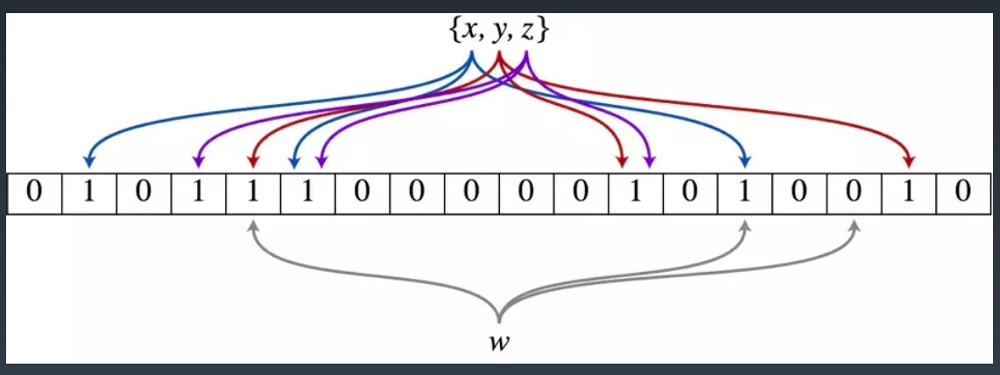

# 学习笔记

## 位运算

### 指定位置的位运算

* 将x最右边的n位清零: `x&(~0<<n)`
* 获取x的第n位值(0或者1): `(x>>n)&1`
* 获取x的第n位的幂值: `x&(1<<n)`
* 仅将第n位置为1: `x|(1<<n)`
* 仅将第n位置为0: `x&(~(1<<n))`
* 将x最高位至第n位(含)清零: `x&((1<<n)-1)`

### 实战位运算要点

* 判断奇偶: x%2==1 —> (x&1)==1, x%2==0 —> (x&1)==0
* x>>1 —> x/2. 即: x=x/2; —> x=x>>1; mid=(left+right)/2; —> mid=(left+right)>>1;
* X=X&(X-1) 清零最低位的1
* X&-X => 得到最低位的1
* X&~X => 0

### N 皇后

```java
public class Solution {
    private int size;
    private int count;

    private void solve(int row, int ld, int rd) {
        if (row == size) {
            count++;
            return;
        }
        int pos = size & (~(row | ld | rd));
        while (pos != 0) {
            int p = pos & (-pos);
            pos -= p; // pos &= pos - 1;
            solve(row | p, (ld | p) << 1, (rd | p) >> 1);
        }
    }

    public int totalNQueens(int n) {
        count = 0;
        size = (1 << n) - 1;
        solve(0, 0, 0);
        return count;
    }
}
```

## 布隆过滤器

### 特点

一个很长的二进制向量和一系列随机映射函数。布隆过滤器可以用于检索 一个元素是否在一个集合中。

优点是空间效率和查询时间都远远超过一般的算法， 缺点是有一定的误识别率和删除困难。

### 示意图



### 实现

```python

from bitarray import bitarray
import mmh3

class BloomFilter:

  def __init__(self, size, hash_num):
    self.size = size
    self.hash_num = hash_num 
    self.bit_array = bitarray(size) 
    self.bit_array.setall(0)

  def add(self, s):
    for seed in range(self.hash_num):
      result = mmh3.hash(s, seed) % self.size 
      self.bit_array[result] = 1

  def lookup(self, s):
    for seed in range(self.hash_num):
      result = mmh3.hash(s, seed) % self.size
      if self.bit_array[result] == 0:
        return "Nope" 
    return "Probably"

bf = BloomFilter(500000, 7) 
bf.add("dantezhao")
print (bf.lookup("dantezhao")) 
print (bf.lookup("yyj"))

```

## LRU 缓存

### 特点

* 两个要素: 大小 、替换策略
* Hash Table + Double LinkedList
* O(1) 查询
* O(1) 修改、更新

[替换算法总览](https://en.wikipedia.org/wiki/Cache_replacement_policies)


### 实现代码

```java
public class LRUCache {
    private Map<Integer, Integer> map;

    public LRUCache(int capacity) {
        map = new LinkedCappedHashMap<>(capacity);
    }

    public int get(int key) {
        if (!map.containsKey(key)) { return -1; }
        return map.get(key);
    }

    public void put(int key, int value) {
        map.put(key, value);
    }

    private static class LinkedCappedHashMap<K, V> extends LinkedHashMap<K, V> {
        int maximumCapacity;

        LinkedCappedHashMap(int maximumCapacity) {
            super(16, 0.75f, true);
            this.maximumCapacity = maximumCapacity;
        }

        protected boolean removeEldestEntry(Map.Entry eldest) {
            return size() > maximumCapacity;
        }
    }
}
```
